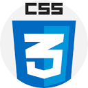

# My GitHub profile:

 

#### Hi!! My name is Hitesh Aggarwal, and I am a 2nd year student of Computer Engineering at [Thapar Institute of Engineering and Technology, Patiala](https://www.thapar.edu/).

 
 

### A short introduction:
* 🌎I am currently exploring Data Structures and Algorithms
* ✌️Looking forward to learn Full Stack Web Development
* ❤️I can type at around 65 wpm.😁

 
 

### Here are the languages and tools I know of:

 
 

### Contact me 📝-

 
 

### My stats:

 

 

